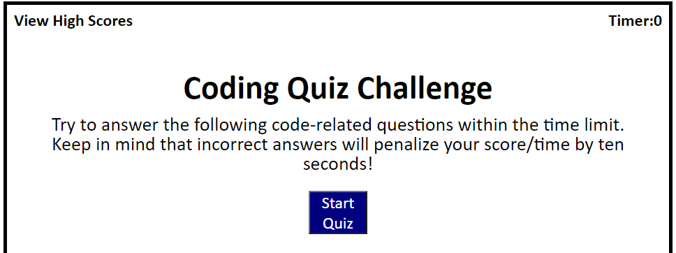

# Code Quiz

## Description

Setup up a quiz to test students knowledge learned. Student was given 60 seconds to complete the quiz. Any incorrect answers were deducted 10 seconds from the time allotted. Students final score is the time that is left on the timer. After completing the quiz, students were able to submit their initials, along with their final score that was saved in localstorage. Final score and initials were displayed on a high scores list.

## Usage

Screenshot

## Deployment

https://jenwariner19.github.io/code-quiz/

## Languages

HTML, CSS, JavaScript

## Credits

Worked with BCS Learning Assistant and classmate, Shannon Price

